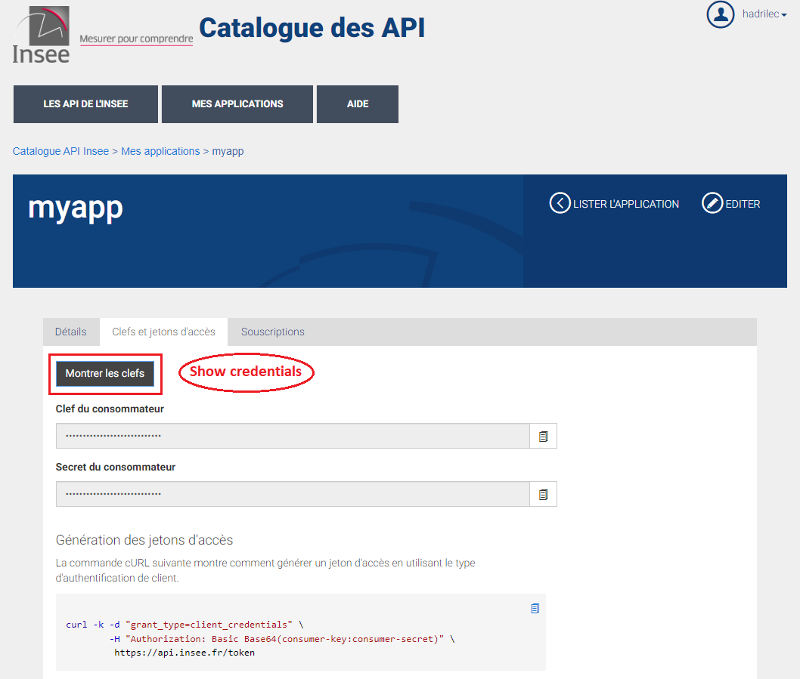
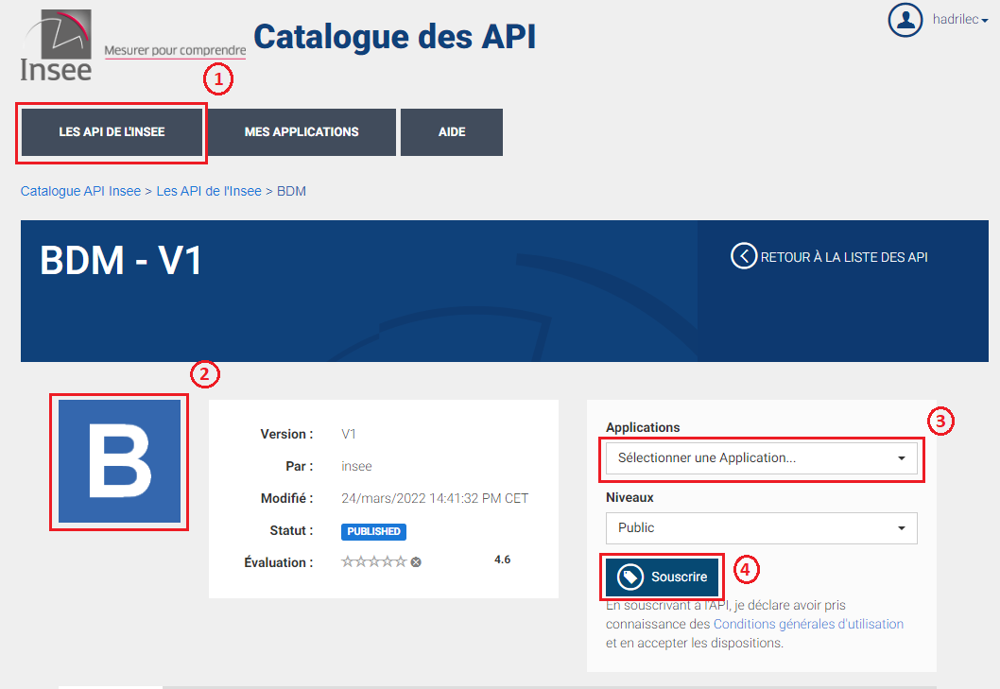

API Subscription Tutorial
=========================

Create an account on api.insee.fr

Create an application

Create credentials

Subscribe to all APIs

Show you credentials

Save your credentials with init_conn function

.. image:: _static/myaccount.png
   :target: _static/myaccount.png
   :alt:

.. image:: _static/myapp.png
   :target: _static/myapp.png
   :alt:

.. image:: _static/mytoken.png
   :target: _static/mytoken.png
   :alt:

