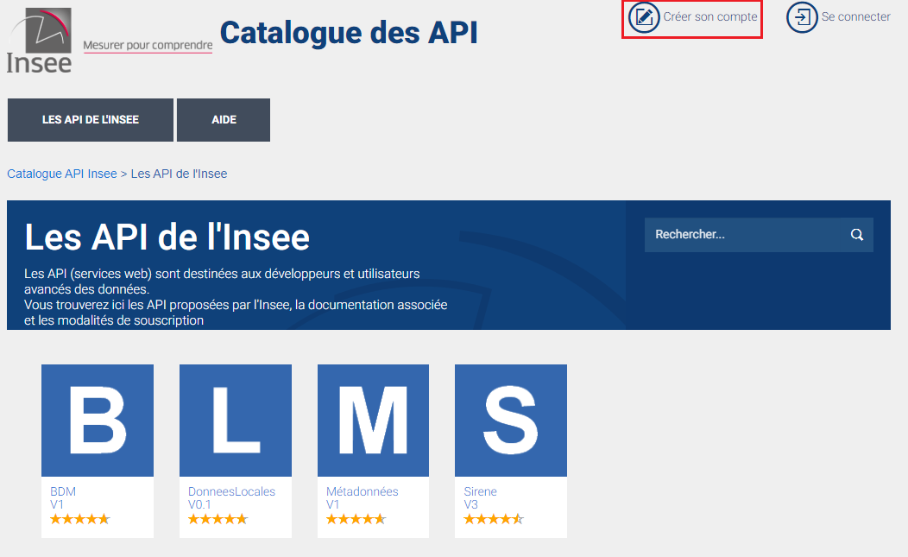
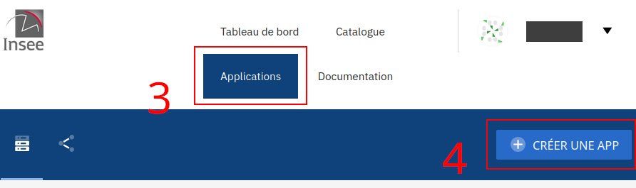
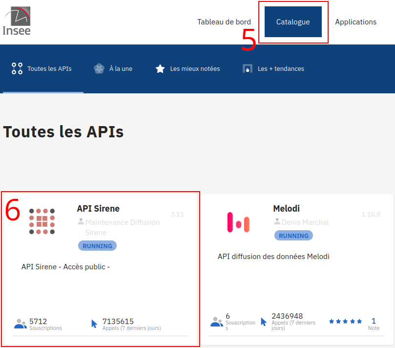
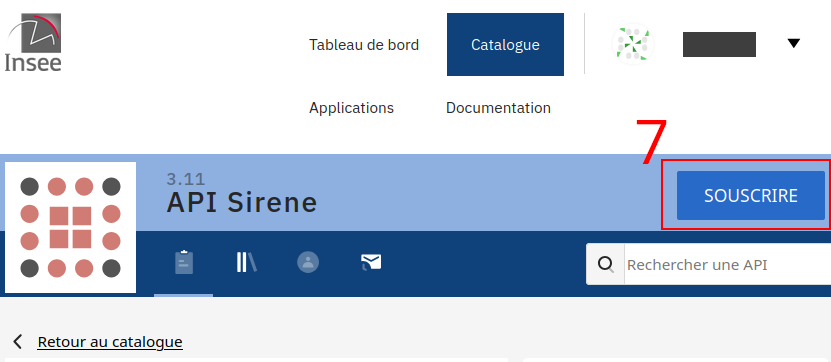
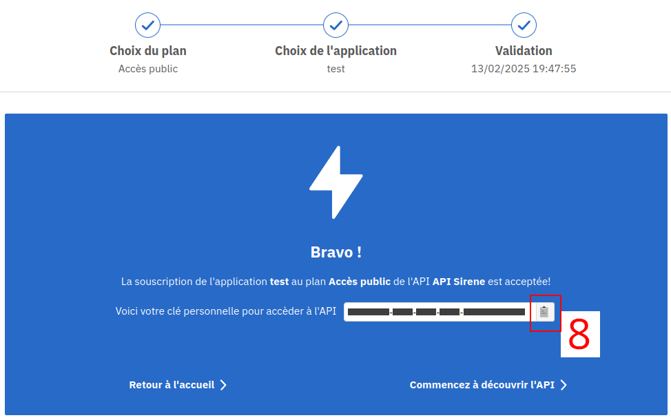

.. role:: raw-html(raw)
    :format: html

Have a look at the official tutorial on `portail-api.insee.fr <https://api.insee.fr/catalogue/site/themes/wso2/subthemes/insee/pages/help.jag>`_

API Subscription Tutorial
=========================

.. note::

    This is only necessary if you want to access data from the SIRENE API, all other APIs are now freely accessible.

Steps to access the SIRENE API via ``pynsee``
---------------------------------------------

#. Create an account on portail-api.insee.fr

#. Create an application

#. Go to catalog, click on SIRENE and subscribe with you newly created application

#. Copy the API key

#. Save your credentials with init_conn function

.. code-block:: python

   # Subscribe to api.insee.fr and get your credentials!
   # Save your credentials with init_conn function :
       from pynsee.utils.init_conn import init_conn
       init_conn(sirene_key="my_sirene_key")

       # Beware: any change to the keys should be tested after having cleared the cache
       # Please do: from pynsee.utils import clear_all_cache; clear_all_cache()

.. note::

    For existing subscriptions, you can always find the key again by going in "Applications", clicking on the application name, then on the "Souscriptions" tab, and finally on "API Sirene": it appears on the right under "Clés d'API"

Images of the subscription steps
--------------------------------

:raw-html:` `

:raw-html:` `

:raw-html:` `

:raw-html:` `

